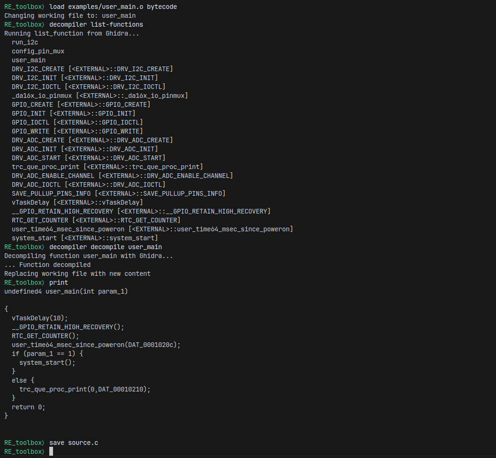

## Reverse-Engineering Toolbox (RE Toolbox)

The Reverse-Engineering Toolbox is a command-line REPL that facilitates reverse engineering and automated program repair efforts.
The REPL is designed to provide a simplified interface to common RE functions.
A plugin system is available for adding new tools to the toolbox. 

### Setup

#### Build Docker Image
To build the docker image, run `docker build -t re_toolbox:latest .` from the root directory

#### Run Docker Image
To run the docker image, run `docker run --rm -it re_toolbox:latest`.
This will create a docker container and drop you into the REPL.
Note that the `exit` command is not currently working properly and you will need to 
use `CTRL+D` to quit the REPL.

### Examples

#### Basic usage

- `load examples/user_main.o bytecode`
- `decompiler list-functions`
- `decompiler decompile user_main`
- `print`
- `save source.c`

#### Plugin usage

- `load examples/user_main.c source`
- `print`
- `info`
- `tool list`
- `tool run clang_format`
- `save formatted.c`
- `info`

